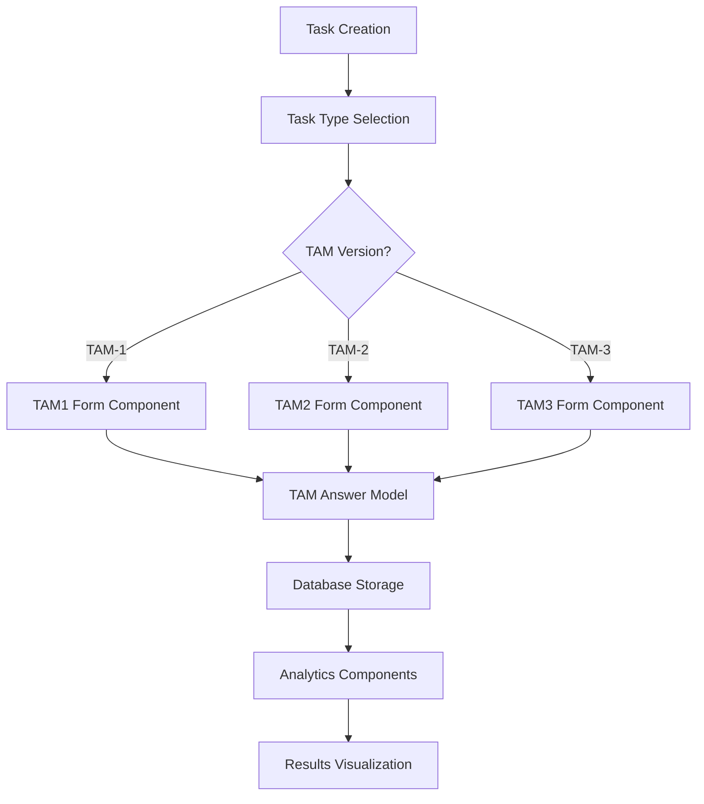

# Design Document

## Overview

This design document outlines the implementation of Technology Acceptance Model (TAM) forms as new task types in the UX testing platform. The implementation will provide three versions of TAM questionnaires (TAM-1, TAM-2, and TAM-3) following the established patterns used for SUS and NASA-TLX forms.

TAM is a widely-used theoretical framework that helps predict and explain user acceptance of technology systems. The original TAM-1 focuses on Perceived Usefulness and Perceived Ease of Use, while TAM-2 and TAM-3 extend the model with additional constructs including social influence, individual differences, and system characteristics.

## Architecture

The TAM implementation follows the existing form architecture pattern:



### Component Integration

The TAM forms integrate into the existing task workflow at the post-task stage, similar to SUS and NASA-TLX forms. The system will:

1. Display the appropriate TAM form based on task type selection
2. Validate form completion before allowing task progression
3. Store responses using structured data models
4. Provide analytics and visualization components for results

## Components and Interfaces

### Form Components

#### TAM1Form.vue

- **Purpose**: Renders the original TAM questionnaire with 12 items (6 for Perceived Usefulness, 6 for Perceived Ease of Use)
- **Props**:
  - `modelValue`: Array of 12 responses
  - `taskIndex`: Number for task identification
- **Events**:
  - `update:modelValue`: Emits response updates
- **Validation**: Ensures all 12 questions are answered before submission

#### TAM2Form.vue

- **Purpose**: Renders the extended TAM-2 questionnaire including social influence constructs
- **Props**:
  - `modelValue`: Object containing all TAM-2 construct responses
  - `taskIndex`: Number for task identification
- **Events**:
  - `update:modelValue`: Emits response updates
- **Constructs**: Perceived Usefulness, Perceived Ease of Use, Subjective Norm, Image, Job Relevance, Output Quality, Result Demonstrability

#### TAM3Form.vue

- **Purpose**: Renders the comprehensive TAM-3 questionnaire with individual differences and system characteristics
- **Props**:
  - `modelValue`: Object containing all TAM-3 construct responses
  - `taskIndex`: Number for task identification
- **Events**:
  - `update:modelValue`: Emits response updates
- **Constructs**: All TAM-2 constructs plus Computer Self-Efficacy, Perception of External Control, Computer Anxiety, Computer Playfulness, Perceived Enjoyment, Objective Usability

### Analytics Components

#### TAMAnalytics.vue

- **Purpose**: Displays aggregated TAM results across all versions
- **Features**:
  - Construct score distributions
  - Comparative analysis between TAM versions
  - Statistical summaries and correlations
  - Visual charts for construct relationships

#### TAM1Analytics.vue

- **Purpose**: Specific analytics for TAM-1 results
- **Features**:
  - Perceived Usefulness vs Perceived Ease of Use scatter plots
  - Score distributions and histograms
  - Reliability statistics

#### TAM2Analytics.vue

- **Purpose**: Extended analytics for TAM-2 results
- **Features**:
  - Social influence factor analysis
  - Cognitive instrumental process visualization
  - Multi-construct correlation matrices

#### TAM3Analytics.vue

- **Purpose**: Comprehensive analytics for TAM-3 results
- **Features**:
  - Individual differences impact analysis
  - System characteristics evaluation
  - Advanced statistical modeling results

## Data Models

### TAMAnswer Model

```javascript
export class TAMAnswer {
  constructor({
    version = 'tam-1',
    // TAM-1 Core Constructs (12 items)
    perceivedUsefulness = Array(6).fill(null),
    perceivedEaseOfUse = Array(6).fill(null),

    // TAM-2 Additional Constructs
    subjectiveNorm = Array(4).fill(null),
    image = Array(3).fill(null),
    jobRelevance = Array(2).fill(null),
    outputQuality = Array(2).fill(null),
    resultDemonstrability = Array(4).fill(null),

    // TAM-3 Additional Constructs
    computerSelfEfficacy = Array(10).fill(null),
    perceptionOfExternalControl = Array(4).fill(null),
    computerAnxiety = Array(4).fill(null),
    computerPlayfulness = Array(7).fill(null),
    perceivedEnjoyment = Array(4).fill(null),
    objectiveUsability = Array(2).fill(null),
  } = {}) {
    this.version = version
    this.perceivedUsefulness = perceivedUsefulness
    this.perceivedEaseOfUse = perceivedEaseOfUse

    // TAM-2 constructs
    if (version === 'tam-2' || version === 'tam-3') {
      this.subjectiveNorm = subjectiveNorm
      this.image = image
      this.jobRelevance = jobRelevance
      this.outputQuality = outputQuality
      this.resultDemonstrability = resultDemonstrability
    }

    // TAM-3 constructs
    if (version === 'tam-3') {
      this.computerSelfEfficacy = computerSelfEfficacy
      this.perceptionOfExternalControl = perceptionOfExternalControl
      this.computerAnxiety = computerAnxiety
      this.computerPlayfulness = computerPlayfulness
      this.perceivedEnjoyment = perceivedEnjoyment
      this.objectiveUsability = objectiveUsability
    }
  }

  toFirestore() {
    const base = {
      version: this.version,
      perceivedUsefulness: this.perceivedUsefulness,
      perceivedEaseOfUse: this.perceivedEaseOfUse,
    }

    if (this.version === 'tam-2' || this.version === 'tam-3') {
      Object.assign(base, {
        subjectiveNorm: this.subjectiveNorm,
        image: this.image,
        jobRelevance: this.jobRelevance,
        outputQuality: this.outputQuality,
        resultDemonstrability: this.resultDemonstrability,
      })
    }

    if (this.version === 'tam-3') {
      Object.assign(base, {
        computerSelfEfficacy: this.computerSelfEfficacy,
        perceptionOfExternalControl: this.perceptionOfExternalControl,
        computerAnxiety: this.computerAnxiety,
        computerPlayfulness: this.computerPlayfulness,
        perceivedEnjoyment: this.perceivedEnjoyment,
        objectiveUsability: this.objectiveUsability,
      })
    }

    return base
  }

  static fromObject(data = {}) {
    return new TAMAnswer(data)
  }
}
```

### TAM Questionnaire Items

#### TAM-1 Items (Original Davis 1989)

**Perceived Usefulness (6 items)**

1. Using [this system] in my job would enable me to accomplish tasks more quickly.
2. Using [this system] would improve my job performance.
3. Using [this system] in my job would increase my productivity.
4. Using [this system] would enhance my effectiveness on the job.
5. Using [this system] would make it easier to do my job.
6. I would find [this system] useful in my job.

**Perceived Ease of Use (6 items)**

1. Learning to operate [this system] would be easy for me.
2. I would find it easy to get [this system] to do what I want it to do.
3. My interaction with [this system] would be clear and understandable.
4. I would find [this system] to be flexible to interact with.
5. It would be easy for me to become skillful at using [this system].
6. I would find [this system] easy to use.

#### TAM-2 Additional Constructs

**Subjective Norm (4 items)**

1. People who influence my behavior think that I should use [this system].
2. People who are important to me think that I should use [this system].
3. The senior management of this business has been helpful in the use of [this system].
4. In general, the organization has supported the use of [this system].

**Image (3 items)**

1. People in my organization who use [this system] have more prestige than those who do not.
2. People in my organization who use [this system] have a high profile.
3. Having [this system] is a status symbol in my organization.

**Job Relevance (2 items)**

1. In my job, usage of [this system] is important.
2. In my job, usage of [this system] is relevant.

**Output Quality (2 items)**

1. The quality of the output I get from [this system] is high.
2. I have no problem with the quality of [this system]'s output.

**Result Demonstrability (4 items)**

1. I have no difficulty telling others about the results of using [this system].
2. I believe I could communicate to others the consequences of using [this system].
3. The results of using [this system] are apparent to me.
4. I would have difficulty explaining why using [this system] may or may not be beneficial.

#### TAM-3 Additional Constructs

**Computer Self-Efficacy (10 items)**

1. I could complete a job or task using [this system] if there was no one around to tell me what to do as I go.
2. I could complete a job or task using [this system] if I could call someone for help if I got stuck.
3. I could complete a job or task using [this system] if I had a lot of time to complete the job for which the software was provided.
4. I could complete a job or task using [this system] if I had just the built-in help facility for assistance.
5. I could complete a job or task using [this system] if someone else had helped me get started.
6. I could complete a job or task using [this system] if I had used similar systems before this one to do the same job.
7. I could complete a job or task using [this system] if someone showed me how to do it first.
8. I could complete a job or task using [this system] if I had never used a system like it before.
9. I could complete a job or task using [this system] if I had only the system manuals for reference.
10. I could complete a job or task using [this system] if I had seen someone else using it before trying it myself.

**Perception of External Control (4 items)**

1. I have control over using [this system].
2. I have the resources necessary to use [this system].
3. I have the knowledge necessary to use [this system].
4. [This system] is not compatible with other systems I use.

**Computer Anxiety (4 items)**

1. I feel apprehensive about using [this system].
2. It scares me to think that I could lose a lot of information using [this system] by hitting the wrong key.
3. I hesitate to use [this system] for fear of making mistakes I cannot correct.
4. [This system] is somewhat intimidating to me.

**Computer Playfulness (7 items)**

1. When using [this system], I am spontaneous.
2. When using [this system], I am playful.
3. When using [this system], I am creative.
4. When using [this system], I am original.
5. When using [this system], I am inventive.
6. When using [this system], I am imaginative.
7. When using [this system], I am flexible.

**Perceived Enjoyment (4 items)**

1. I find using [this system] to be enjoyable.
2. The actual process of using [this system] is pleasant.
3. I have fun using [this system].
4. Using [this system] provides me with a lot of enjoyment.

**Objective Usability (2 items)**

1. [This system] often behaves in unexpected ways.
2. [This system] makes it easy to recover from errors.

## Correctness Properties

_A property is a characteristic or behavior that should hold true across all valid executions of a system-essentially, a formal statement about what the system should do. Properties serve as the bridge between human-readable specifications and machine-verifiable correctness guarantees._

Now I'll analyze the acceptance criteria to determine which are testable as properties:

Based on the prework analysis, the following properties validate the TAM implementation:

### Property 1: TAM Form Display Routing

_For any_ TAM task type (tam-1, tam-2, tam-3), when selected in the task system, the correct corresponding TAM form component should be displayed
**Validates: Requirements 1.2, 7.1**

### Property 2: TAM Form Validation

_For any_ TAM form (TAM-1, TAM-2, or TAM-3) with incomplete responses, form submission should be prevented and missing answers should be highlighted
**Validates: Requirements 1.3, 2.3, 3.3, 4.3, 7.3**

### Property 3: TAM Data Serialization Round Trip

_For any_ valid TAM answer object, serializing to Firestore format then deserializing should produce an equivalent object
**Validates: Requirements 5.2, 5.3**

### Property 4: TAM Score Calculation Accuracy

_For any_ complete TAM response set, calculated construct scores should match validated TAM scoring algorithms including proper handling of reverse-coded items
**Validates: Requirements 2.4, 3.4, 4.4, 8.1, 8.2**

### Property 5: TAM Data Storage Integrity

_For any_ submitted TAM form, responses should be stored with proper task references and both individual item responses and computed construct scores should be preserved
**Validates: Requirements 1.4, 7.4, 8.3**

### Property 6: TAM Version Support

_For any_ TAM version (tam-1, tam-2, tam-3), the TAM_Answer_Model should correctly handle version-specific properties and provide appropriate defaults
**Validates: Requirements 5.4**

### Property 7: TAM Analytics Aggregation

_For any_ set of multiple participant TAM responses, the analytics system should correctly aggregate results and provide comparative analysis across participants
**Validates: Requirements 6.2, 6.3**

## Error Handling

### Form Validation Errors

- **Incomplete Responses**: Display clear error messages indicating which questions require answers
- **Invalid Scale Values**: Prevent submission of responses outside the 1-7 Likert scale range
- **Network Errors**: Provide retry mechanisms for form submission failures
- **Data Corruption**: Validate data integrity before storage and provide recovery options

### Calculation Errors

- **Missing Data**: Handle cases where construct scores cannot be calculated due to missing responses
- **Invalid Responses**: Validate response values before performing calculations
- **Precision Errors**: Use appropriate rounding and precision for score calculations
- **Algorithm Errors**: Implement fallback scoring methods if primary algorithms fail

### Storage Errors

- **Database Failures**: Implement retry logic and local storage backup for form responses
- **Schema Mismatches**: Validate data structure before attempting to store in Firestore
- **Permission Errors**: Handle authentication and authorization failures gracefully
- **Quota Limits**: Implement rate limiting and queue mechanisms for high-volume submissions

## Testing Strategy

### Unit Testing

The implementation will include comprehensive unit tests for:

- **Form Components**: Test rendering, user interactions, and validation logic
- **Data Models**: Test serialization, deserialization, and data transformation
- **Calculation Utilities**: Test TAM scoring algorithms with known input/output pairs
- **Analytics Components**: Test data aggregation and visualization logic

### Property-Based Testing

Property-based tests will validate universal correctness properties using a minimum of 100 iterations per test:

- **Property 1 Test**: Generate random TAM task types and verify correct form component rendering
  - **Tag**: Feature: tam-forms-implementation, Property 1: TAM Form Display Routing
- **Property 2 Test**: Generate random incomplete TAM responses and verify validation prevents submission
  - **Tag**: Feature: tam-forms-implementation, Property 2: TAM Form Validation
- **Property 3 Test**: Generate random TAM answer objects and verify serialization round-trip consistency
  - **Tag**: Feature: tam-forms-implementation, Property 3: TAM Data Serialization Round Trip
- **Property 4 Test**: Generate random complete TAM responses and verify score calculation accuracy
  - **Tag**: Feature: tam-forms-implementation, Property 4: TAM Score Calculation Accuracy
- **Property 5 Test**: Generate random TAM submissions and verify data storage integrity
  - **Tag**: Feature: tam-forms-implementation, Property 5: TAM Data Storage Integrity
- **Property 6 Test**: Generate random TAM versions and verify model handles version-specific properties
  - **Tag**: Feature: tam-forms-implementation, Property 6: TAM Version Support
- **Property 7 Test**: Generate random multi-participant TAM data and verify analytics aggregation
  - **Tag**: Feature: tam-forms-implementation, Property 7: TAM Analytics Aggregation

### Integration Testing

Integration tests will verify:

- **Task Workflow Integration**: TAM forms appear at correct stages in task execution
- **Database Integration**: TAM data is properly stored and retrieved from Firestore
- **Analytics Integration**: TAM results are correctly displayed in study analytics
- **User Interface Integration**: TAM forms follow consistent UI patterns with existing forms

### Testing Framework

The implementation will use Jest for unit testing and fast-check for property-based testing, following the established patterns used for SUS and NASA-TLX testing.
