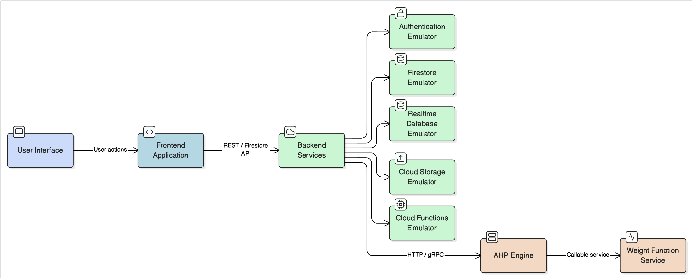

# CONTRIBUTING.md — RUXAILAB

[](CONTRIBUTING.md)
[](https://vuejs.org/)
[](https://www.python.org/)
[](https://firebase.google.com/)

This guide covers everything you need to know to contribute to RUXAILAB: the system architecture, development setup, feature-specific workflows, and how to submit quality code.

RUXAILAB is an open-source platform for conducting professional UX research. It supports multiple methodologies including user testing, heuristic evaluation, card sorting, and accessibility assessment. Whether you're adding features, fixing bugs, or improving documentation, this guide will walk you through the process.

> **Security First**
> Never commit real secrets or credentials. Use `YOUR_*` placeholders in examples and keep actual credentials in CI secrets and `.env` files (which are git-ignored).

---

## What is RUXAILAB?

RUXAILAB provides researchers with tools to conduct systematic usability studies:

- **User Testing**: Collect feedback from real users performing tasks (unmoderated or moderated sessions)
- **Heuristic Evaluation**: Expert assessment of products against Nielsen's usability heuristics with AI-powered weight calculation
- **Card Sorting**: Help researchers understand user mental models for information architecture
- **Accessibility Assessment**: Evaluate WCAG 2.1 compliance through manual expert review or automated scanning
- **Analytics & Reporting**: Statistical analysis of results with comprehensive PDF reports

The platform handles the full research lifecycle: study creation, participant management, data collection, analysis, and reporting.

---

## Table of Contents

1. [Quick Start](#1-quick-start)
2. [System Architecture](#2-system-architecture)
3. [Tech Stack](#3-tech-stack)
4. [Local Development Setup](#4-local-development-setup)
5. [Study Types and Workflows](#5-study-types-and-workflows)
6. [Vue Components and State Management](#6-vue-components-and-state-management)
7. [Python AHP Weight Function](#7-python-ahp-weight-function)
8. [Firebase and Emulators](#8-firebase-and-emulators)
9. [Testing](#9-testing)
10. [CI/CD Pipeline](#10-cicd-pipeline)
11. [Contributing](#11-contributing)
12. [Troubleshooting](#12-troubleshooting)

---

## 1. Quick Start

Get the development environment running in about 2 minutes:

```bash
# Clone the repository
git clone https://github.com/ruxailab/RUXAILAB.git
cd RUXAILAB

# Install Node dependencies
npm install

# Set up Python environment for the AHP engine
cd weight_function
python -m venv venv
source venv/bin/activate  # Windows: venv\Scripts\activate
pip install -r requirements.txt
cd ..

# Copy environment configuration
cp .env.example .env
# Edit .env with your Firebase project credentials

# Start everything
firebase emulators:start &
npm run serve
```

You should now be able to access the application at http://localhost:5000 and the emulator dashboard at http://localhost:4000.

---

## 2. System Architecture

### How the System Works

RUXAILAB has three main layers that work together:



**Frontend Layer (Vue 3 + Vuetify)**
The browser runs a responsive Vue 3 application that handles all user interactions. It communicates with Firebase services to read and write study data. Researchers create studies, experts enter evaluations, and participants complete tasks all through this interface.

**Backend Layer (Firebase)**
Firebase provides the entire backend infrastructure. Authentication handles user login, Firestore stores all application data (studies, responses, results), Cloud Functions process logic like sending notifications, and Cloud Storage holds media files. For development, we use the Firebase Emulator Suite which simulates all these services locally.

**Analysis Engine (Python)**
For heuristic evaluation, a Python service running as a Firebase Function performs the Analytic Hierarchy Process (AHP) computation. When experts provide pairwise comparisons of heuristic importance, this engine calculates normalized weights that ensure consistency across all expert opinions.

### Data Flow

When a researcher creates a heuristic evaluation study, this is what happens:

1. Researcher fills in study details and selects heuristics in the Vue UI
2. Frontend sends the study to Firebase Cloud Functions
3. Functions validate the data and store it in Firestore
4. A Study document is created and stored permanently
5. An empty Answers document is created to hold responses

When an expert evaluates the product:

1. Expert accesses the study and provides pairwise comparison judgments
2. Frontend sends comparisons to the Python AHP function
3. AHP calculates weights and consistency metrics
4. Frontend displays the weights and prompts expert to rate each heuristic
5. Expert submissions are stored in the Answers document
6. System calculates aggregate statistics and generates report

---

## 3. Tech Stack

### Core Requirements

| Component | Version | Reason |
|-----------|---------|--------|
| Node.js | ≤ 24.12.0 | Firebase CLI requires this specific range |
| Vue.js | 3.5.26 | Latest with Composition API support |
| Vuetify | 3.11.6 | Material Design components |
| Python | 3.11.8 | AHP engine backend |
| Firebase SDK | 9.23.0 (client) / 13.6.0 (admin) | Cloud services integration |

### Project Language Breakdown

- Vue: 76.8%
- JavaScript: 21.7%
- Python: 0.9%
- TypeScript: 0.3%
- Other: 0.3%

The project is primarily Vue-based with JavaScript for complex logic. TypeScript usage is minimal—use JavaScript for new code unless absolutely necessary.

### Development Tools

| Tool | Config File | Purpose |
|------|------------|---------|
| Code Formatter | `.prettierrc` | Ensures consistent code style |
| Linter | `eslint.config.mjs` | Catches common JavaScript issues |
| Pre-commit Hooks | `.husky/` | Runs lint before commits |
| Unit Tests | `jest.config.js` | Component and utility testing |
| E2E Tests | `playwright.config.ts` | Full workflow testing |
| Internationalization | `src/locales/` | English and Spanish support |
| State Management | `src/store/` | Vuex with feature modules |

### Browser Support

Defined in `.browserslistrc`. Testing should include:

- Chrome and Chromium (latest 2 versions)
- Firefox (latest 2 versions)
- Safari (latest 2 versions)
- Edge (latest 2 versions)

---

## 4. Local Development Setup

### Prerequisites

Before starting, make sure you have:

- Node.js 24.12.0 or lower (use nvm to manage versions: `nvm install 24.12.0 && nvm use 24.12.0`)
- Python 3.11.8 (use pyenv: `pyenv install 3.11.8`)
- Firebase CLI installed globally: `npm install -g firebase-tools`
- A Firebase project (free tier is fine for development)
- Git

### Step 1: Clone and Install Dependencies

```bash
git clone https://github.com/ruxailab/RUXAILAB.git
cd RUXAILAB
npm install
```

Verify your Node version:
```bash
node --version    # Should be ≤ 24.12.0
npm --version     # Any recent version is fine
```

### Step 2: Set Up Python Environment

```bash
cd weight_function
python3.11 --version  # Confirm version 3.11.8
python -m venv venv
source venv/bin/activate  # Windows: venv\Scripts\activate
pip install --upgrade pip
pip install -r requirements.txt
cd ..
```

### Step 3: Create Firebase Project

Go to [Firebase Console](https://console.firebase.google.com):

1. Create a new project
2. Enable Firestore Database (choose a region close to you)
3. Enable Realtime Database
4. Go to Project Settings and copy your Firebase configuration

### Step 4: Configure Environment

```bash
cp .env.example .env
```

Open `.env` and fill in your Firebase credentials:

```properties
VUE_APP_I18N_LOCALE=en
VUE_APP_I18N_FALLBACK_LOCALE=en

VUE_APP_FIREBASE_API_KEY=YOUR_FIREBASE_API_KEY
VUE_APP_FIREBASE_AUTH_DOMAIN=YOUR_FIREBASE_AUTH_DOMAIN
VUE_APP_FIREBASE_PROJECT_ID=YOUR_FIREBASE_PROJECT_ID
VUE_APP_FIREBASE_STORAGE_BUCKET=YOUR_FIREBASE_STORAGE_BUCKET
VUE_APP_FIREBASE_MESSAGING_SENDER_ID=YOUR_FIREBASE_MESSAGING_SENDER_ID
VUE_APP_FIREBASE_APP_ID=YOUR_FIREBASE_APP_ID

VUE_APP_FIREBASE_PYTHON_FUNCTION=http://localhost:5001/YOUR_PROJECT_ID/us-central1/weightFunction
```

Never commit `.env`. It's already in `.gitignore`.

### Step 5: Start Firebase Emulators

```bash
firebase use default
firebase emulators:start
```

You should see output showing all emulators starting on different ports:

```
✔  Auth emulator started at http://localhost:9099
✔  Firestore emulator started at http://localhost:8081
✔  Storage emulator started at http://localhost:9199
✔  Functions emulator started at http://localhost:5001
✔  Hosting emulator started at http://localhost:5000
✔  Hub emulator started at http://localhost:4000
```

### Step 6: Start Frontend Dev Server

In a new terminal:

```bash
npm run serve
```

Open http://localhost:5000 in your browser. You should see the RUXAILAB login screen.

### Step 7: Test the Setup

**Sign in with test credentials:**
- Email: `testemail@gmail.com`
- Password: `password123`

These are emulator-only credentials. In production, real authentication is used.

**Verify emulator services:**
- Firestore: http://localhost:8081
- Emulator UI: http://localhost:4000
- Auth Emulator: http://localhost:9099

---

## 5. Study Types and Workflows

RUXAILAB supports five different research methodologies. Each has its own data structure and workflow.

### User Testing

Researchers recruit users to test a website or application while providing feedback.

**Workflow:**
1. Researcher creates study and defines tasks users will perform
2. Users receive a link to the study
3. User reads welcome message and consent form
4. User completes pre-test survey (optional)
5. User performs tasks on the target website
6. User answers post-test questions
7. User completes System Usability Scale (SUS) questionnaire
8. User sees thank you message

**Subtypes:**
- Unmoderated: Users complete at their own pace from any location
- Moderated: Researcher observes and may ask clarifying questions (future feature)

**Code location:** `src/ux/UserTest/`

### Heuristic Evaluation

Experts evaluate a product using Nielsen's 10 usability heuristics. The system uses weighted scoring based on expert consensus.

**Workflow:**
1. Researcher creates study and selects heuristics to evaluate
2. Researcher invites experts and configures evaluation scale
3. Expert performs pairwise comparisons of heuristic importance (AHP phase)
4. Python engine calculates normalized weights
5. Expert rates product against each heuristic using the scale
6. System computes weighted usability score
7. Report shows individual expert scores plus aggregated statistics

**Nielsen's 10 Heuristics:**
- Visibility of system status
- Match between system and real world
- User control and freedom
- Consistency and standards
- Error prevention
- Error recovery
- Flexibility and efficiency
- Aesthetic and minimalist design
- Help and documentation
- Custom heuristics (researcher-defined)

**Code location:** `src/ux/Heuristic/`

### Card Sorting

Researchers understand user mental models by having users organize content into categories.

**Subtypes:**
- Open: Users create their own categories
- Closed: Users sort into predefined categories

**Code location:** `src/ux/CardSorting/`

### Accessibility Assessment

Experts evaluate conformance to WCAG 2.1 accessibility guidelines.

**Subtypes:**
- Manual: Expert reviews using checklist and automated tools
- Automatic: Scanning tool identifies common violations

**Code location:** `src/ux/accessibility/`

### Survey and Analytics (Planned)

Future feature for collecting quantitative data and analyzing trends.

---

## 6. Vue Components and State Management

### Folder Organization

```
src/
├── main.js                  # Application entry point
├── app/
│   ├── App.vue              # Root Vue component
│   ├── router/
│   │   └── index.js         # Route definitions
│   ├── plugins/
│   │   ├── vuetify.js       # Material Design theme setup
│   │   ├── i18n.js          # Internationalization
│   │   └── firebase.js      # Firebase SDK initialization
│   └── layouts/
│       ├── AppLayout.vue    # Main authenticated layout
│       └── AuthLayout.vue   # Login/signup layout
├── store/
│   ├── index.js             # Store root
│   ├── modules/
│   │   └── Study.js         # Study CRUD operations
│   └── [other modules]      # Feature-specific stores
├── features/                # Feature modules
│   ├── auth/                # Login and authentication
│   ├── dashboard/           # Home screen and study list
│   ├── ux_creation/         # Study creation wizard
│   └── navigation/          # Navigation components
├── ux/                      # Research methodology implementations
│   ├── UserTest/            # User testing interface
│   ├── Heuristic/           # Heuristic evaluation
│   ├── CardSorting/         # Card sorting
│   └── accessibility/       # WCAG testing
├── shared/                  # Reusable code
│   ├── models/              # Data models and classes
│   ├── constants/           # Constants and enums
│   ├── components/          # Reusable components
│   ├── store/               # Shared store modules
│   └── utils/               # Helper functions
└── locales/                 # i18n translations
```

### State Management with Vuex

The application uses Vuex for centralized state management. Each feature has its own module:

| Module | Responsibility |
|--------|-----------------|
| Auth | User login state and authentication |
| Tests (Study) | CRUD operations for studies |
| Heuristic | Heuristic-specific state |
| UserStudy | User testing configuration |
| CardStudy | Card sorting configuration |
| Answer | Study responses and results |
| Assessment | Accessibility evaluation |
| Dashboard | Study listings and dashboard state |
| Language | Current language preference |

### Accessing State in Components

Use the modern Composition API approach for new code:

```javascript
import { useStore } from 'vuex'
import { computed } from 'vue'

export default {
  setup() {
    const store = useStore()
    
    // Read values that change
    const currentStudy = computed(() => store.getters.test)
    const isLoading = computed(() => store.state.loading)
    
    // Call actions to modify state
    const saveStudy = async (studyData) => {
      await store.dispatch('updateStudy', studyData)
    }
    
    return { currentStudy, isLoading, saveStudy }
  }
}
```

Avoid the Options API (mapGetters, mapState) in new code.

### Creating a Study: Data Flow Example

Understanding how data flows through the system:

```
User Form Input
  ↓
Vue Component calls store.dispatch('createStudy', studyData)
  ↓
Study.js action calls StudyController.createStudy()
  ↓
Controller validates and sends to Firestore
  ↓
Firestore creates document and returns ID
  ↓
Action commits SET_TEST(study) to update store
  ↓
Component updates via computed property
  ↓
Vue re-renders automatically
```

---

## 7. Python AHP Weight Function

### Understanding the Analytic Hierarchy Process

When multiple experts evaluate a product, they often disagree on the relative importance of different heuristics. The Analytic Hierarchy Process (AHP) provides a mathematical framework to handle this disagreement consistently.

Here's how it works:

1. **Pairwise Comparisons**: Each expert compares heuristics two at a time, saying things like "Consistency is 3 times more important than Error Prevention"
2. **Matrix Construction**: These comparisons form a matrix
3. **Eigenvalue Calculation**: Mathematical analysis derives a weight vector from the matrix
4. **Consistency Check**: The system measures whether the expert's judgments are logically consistent

In RUXAILAB, if expert A says "H1 is 3x more important than H2" and expert B says "H1 is 5x more important than H2", the system calculates a consensus: H1 is approximately 4x more important.

### Location and Implementation

```
weight_function/
├── main.py              # Firebase Cloud Function entry point
├── requirements.txt     # Python package dependencies
├── venv/                # Virtual environment (not committed)
└── [other modules]      # Supporting code
```

### How the Algorithm Works

```python
def calculate_eigen(matrix):
    """
    Takes a pairwise comparison matrix and returns:
    - Normalized weights (sum to 1.0)
    - Consistency Index (CI)
    - Consistency Ratio (CR)
    - Interpretation (Consistent if CR <= 0.1)
    """
```

Example comparison matrix for 3 heuristics:

```
       H1   H2   H3
H1  [  1    3    5  ]  H1 is baseline
H2  [ 1/3   1    2  ]  H1 is 3x more important than H2
H3  [ 1/5  1/2   1  ]  H1 is 5x more important than H3
```

The algorithm produces normalized weights: H1 = 0.645, H2 = 0.223, H3 = 0.133

### Local Testing

To test the AHP function locally:

```bash
cd weight_function
source venv/bin/activate
firebase emulators:start --only functions

# In another terminal:
curl -X POST http://localhost:5001/YOUR_PROJECT_ID/us-central1/weightFunction \
  -H "Content-Type: application/json" \
  -d '{
    "matrix": [[1,3,5],[0.333,1,2],[0.2,0.5,1]]
  }'
```

### Deploying to Production

The Python function requires Firebase Blaze billing plan (the free Spark plan doesn't support Python functions):

```bash
# Upgrade Firebase project to Blaze plan first
firebase deploy --only functions
```

Then update your production `.env`:

```properties
VUE_APP_FIREBASE_PYTHON_FUNCTION=https://us-central1-YOUR_PROJECT_ID.cloudfunctions.net/weightFunction
```

### Using AHP Results in the Frontend

When experts submit their evaluations:

1. Frontend collects the pairwise comparison judgments
2. Sends the comparison matrix to the Python AHP function
3. Function returns weights and consistency metrics
4. Frontend displays the weights for expert review
5. If Consistency Ratio > 0.1, the system warns that judgments are inconsistent and asks for review

---

## 8. Firebase and Emulators

### Emulator Services and Ports

During development, the Firebase Emulator Suite provides fake versions of all backend services:

| Service | Port | Purpose |
|---------|------|---------|
| Firestore | 8081 | NoSQL database for documents |
| Realtime Database | 9000 | Real-time JSON database |
| Authentication | 9099 | User login and management |
| Storage | 9199 | File storage |
| Functions | 5001 | Backend functions (Node and Python) |
| Hosting | 5000 | Frontend server |
| Emulator Hub | 4000 | Dashboard for all emulators |

### Configuration Files

| File | Purpose |
|------|---------|
| firebase.json | Defines emulator ports, hosting settings, and build hooks |
| .firebaserc | Project aliases used by deploy commands |
| firestore.rules | Security rules for database access |
| storage.rules | Security rules for file uploads |
| firestore.indexes.json | Composite index definitions |

### Database Structure

Understanding how data is organized in Firestore:

```
/tests
  /testId1/
    testTitle: "Website Usability Study"
    testType: "HEURISTIC"
    testStructure: { heuristics: [...], questions: [...] }
    testWeights: { h1: 0.45, h2: 0.15, ... }
    status: "active"

/answers
  /answersDocId1/
    type: "HEURISTIC"
    evaluatorStatistics: [{ userDocId, heuristics: [...] }, ...]
    heuristicAnswers: { ... }
    submitted: true

/users
  /userId1/
    email: "researcher@example.com"
    displayName: "Jane Researcher"
    myTests: { testId1: true }
    accessLevel: 1

/templates
  /templateId1/
    body: { testType, testStructure, testOptions }
    header: { templateTitle, templateAuthor, ... }
```

### Security Rules in Development

In the emulator environment, security rules are permissive by default. For production deployments, rules should restrict access:

```javascript
// Example production rules
rules_version = '2';
service cloud.firestore {
  match /databases/{database}/documents {
    match /tests/{testId} {
      allow read: if request.auth != null;
      allow write: if request.auth.uid == resource.data.testAdmin.userDocId;
    }
    match /answers/{answersDocId} {
      allow read: if request.auth != null;
      allow write: if request.auth != null;
    }
  }
}
```

---

## 9. Testing

Quality code requires thorough testing. RUXAILAB uses multiple testing approaches.

### Unit Tests with Jest

Unit tests verify that individual functions and components work correctly in isolation.

**When to write unit tests:**
- Helper functions and utility logic
- Vuex getters and complex state transformations
- Component computed properties
- Services and controllers

**Where to put tests:**
- Co-locate with source: `component.spec.js` next to `component.vue`
- Or in `tests/unit/` directory

**Example test:**

```javascript
// src/ux/Heuristic/utils/statistics.spec.js
import { calcFinalResult } from './statistics'

describe('Heuristic Statistics', () => {
  it('calculates correct average score', () => {
    const evaluatorScores = [80, 85, 75]
    const result = calcFinalResult(evaluatorScores)
    expect(result.average).toBeCloseTo(80)
  })

  it('handles empty scores', () => {
    const result = calcFinalResult([])
    expect(result.average).toBe(0)
  })
})
```

**Running tests:**

```bash
npm run test:unit
npm run test:unit:coverage    # Shows coverage report
```

### E2E Tests with Playwright

End-to-end tests verify that complete user workflows function correctly, from login through report generation.

**Critical workflows to test:**
1. Create study, configure heuristics, complete evaluation, view results
2. Create user test, invite participants, collect responses, generate report
3. Join collaborative study, complete accessibility review
4. Access public study link without authentication

**Example test:**

```javascript
import { test, expect } from '@playwright/test'

test('create heuristic study and evaluate', async ({ page }) => {
  // Navigate to login
  await page.goto('http://localhost:5000/signin')
  
  // Login
  await page.getByLabel('Email').fill('testemail@gmail.com')
  await page.getByLabel('Password').fill('password123')
  await page.getByTestId('sign-in-button').click()
  
  // Wait for dashboard
  await expect(page.getByTestId('create-test-btn')).toBeVisible({ timeout: 7000 })
  
  // Start study creation
  await page.getByTestId('create-test-btn').click()
  await page.getByText('Heuristic Evaluation').click()
  
  // Fill study details
  await page.getByLabel('Study Title').fill('Website Redesign Evaluation')
  await page.getByLabel('Description').fill('Evaluating the new design against usability heuristics')
  await page.getByRole('button', { name: 'Create Study' }).click()
  
  // Verify success
  await expect(page.getByText('Website Redesign Evaluation')).toBeVisible()
})
```

**Running E2E tests:**

```bash
npm run test:e2e              # Headless mode
npm run test:e2e:ui           # Interactive mode with UI
npm run test-html-report      # Generate HTML report
```

### Python Tests for AHP

```bash
cd weight_function
source venv/bin/activate
pytest -v
```

### Accessibility Testing

Manual testing using browser tools:

```bash
lighthouse http://localhost:5000 --view
```

Automated WCAG scanning is part of the accessibility module.

---

## 10. CI/CD Pipeline

The project uses GitHub Actions to automatically test and deploy code.

### On Every Pull Request

1. Install dependencies
2. Run linter and formatter
3. Execute unit tests
4. Run E2E tests in containers
5. Analyze code with SonarCloud
6. Check for secrets in code

### On Merge to Main/Develop

All PR checks plus:

1. Build production bundle
2. Run performance checks
3. Deploy to Firebase hosting (if approved)

### Pre-commit Hooks

Git hooks (via Husky) run automatically before commits:

```bash
npm run lint      # ESLint
npm run format    # Prettier
```

To bypass (not recommended):

```bash
git commit --no-verify
```

---

## 11. Contributing

### Branching

Create feature branches from `develop`:

```
feature/add-custom-heuristics
fix/consistency-calculation-bug
docs/update-setup-guide
test/add-card-sorting-e2e
refactor/simplify-vuex-modules
```

### Commits

Follow Conventional Commits format:

```
feat(heuristic): Add custom heuristic support
fix(accessibility): Correct WCAG rule mapping
docs(contributing): Add AHP explanation
test(e2e): Add user test workflow
refactor(store): Consolidate Study module
chore(deps): Update Vuetify to 3.11.7
```

Keep commits atomic and focused. Each commit should build and pass tests.

### Before Creating a Pull Request

Developer checklist:

- Branched from `develop`
- Rebased and resolved any conflicts
- Linter passes: `npm run lint`
- Formatter applied: `npm run format`
- Unit tests pass: `npm run test:unit`
- E2E tests added for new features
- No console errors or warnings
- `.env` file not included
- Documentation updated (README, CONTRIBUTING)
- No secrets or credentials in code

### Pull Request Template

```markdown
## What does this PR do?
Brief description of changes

## Why?
Motivation and problem this solves

## How to test?
1. Start emulators
2. Navigate to...
3. Verify that...

## Type of Change
- [ ] Bug fix
- [ ] New feature
- [ ] Documentation
- [ ] Breaking change

## Testing
- [ ] Unit tests added
- [ ] E2E tests added
- [ ] Manual testing completed

## Impact
- Performance: [no impact / improves / affects]
- Security: [no impact / fixes / affects]
- Accessibility: [no impact / improves / affects]

## Screenshots (if UI change)
[Before/After]
```

### Code Review and Merging

Requirements before merge:

- Minimum 1 maintainer approval (2 for major features)
- CI pipeline passes completely
- No increase in code quality issues (SonarCloud)
- All conversations resolved

Preferred merge strategy: Rebase and merge for linear history.

---

## 12. Troubleshooting

### Firebase Emulators

**Port already in use:**

```bash
# Find which process is using the port
lsof -i :5001

# Kill it
kill -9 <PID>

# Or change ports in firebase.json
{
  "functions": { "port": 5051 },
  "firestore": { "port": 8181 }
}
```

**Firebase not initialized:**

Make sure emulator connection code is uncommented in `src/plugins/firebase.js`:

```javascript
if (process.env.NODE_ENV === 'development') {
  connectAuthEmulator(auth, "http://localhost:9099")
  connectFirestoreEmulator(db, "localhost", 8081)
  connectStorageEmulator(storage, "localhost", 9199)
}
```

**Python function returns 404:**

Update `.env` with the correct function URL after emulators start. Check the emulator console output for the exact URL.

### Vue and JavaScript

**Linter errors for undefined variables:**

```bash
npm run lint:fix    # Auto-fix many issues
```

Common fixes:
- Add missing imports: `import { useStore } from 'vuex'`
- Add missing lifecycle hooks: `import { onMounted } from 'vue'`

**State not updating:**

Verify Vuex modules are properly configured:

```javascript
export default {
  namespaced: true,  // REQUIRED for feature modules
  state: { },
  mutations: { },
  actions: { }
}
```

### Testing

**Playwright test timeout:**

Increase timeout in `playwright.config.ts`:

```javascript
use: {
  timeout: 30000,
  navigationTimeout: 30000
}
```

**E2E passes locally but fails in CI:**

CI environment is headless and may have network delays. Add explicit waits:

```javascript
// Good
await expect(page.getByRole('button', { name: 'Submit' })).toBeVisible({ timeout: 5000 })
await page.getByRole('button', { name: 'Submit' }).click()

// Avoid
await page.click('button')
```

### Data and State

**Heuristic weights are NaN:**

Verify the AHP comparison matrix has no zeros and is reciprocal:

```javascript
// Invalid: has 0
matrix = [[1, 0, 5], [0, 1, 2], [1/5, 1/2, 1]]

// Valid: all reciprocal
matrix = [[1, 3, 5], [1/3, 1, 2], [1/5, 1/2, 1]]
```

**Data not persisting after refresh:**

In development, all data is in memory. In production, verify Firestore security rules allow writes.

### Performance

**Slow dashboard loading:**

Check DevTools Network tab for excessive Firestore queries. Consider using snapshot subscriptions instead of individual reads in loops.

**E2E tests very slow:**

Run tests in parallel:

```javascript
// playwright.config.ts
fullyParallel: true,
workers: process.env.CI ? 1 : 4
```

---

## Learning Resources

To understand the codebase better, explore these areas:

- `src/ux/Heuristic/`: See how heuristic evaluation is implemented
- `src/ux/UserTest/`: User testing workflow and task management
- `src/store/modules/Study.js`: Core state management logic
- `weight_function/main.py`: AHP algorithm implementation
- `e2e/`: Example workflows and testing patterns

Read the existing code thoughtfully. Look for patterns and conventions before writing new code.

---

## Getting Help

- **Questions about contributing?** Open a GitHub Discussion
- **Found a bug?** Create a GitHub Issue
- **Need design clarification?** Ask in the repo Issues
- **General support?** Contact the maintainers

---

## Summary for Contributors

RUXAILAB is a sophisticated research platform. When contributing:

1. Understand which study type your changes affect
2. Know how Vuex state flows through the application
3. Set up emulators correctly for reliable development
4. Write tests for critical paths
5. Follow Conventional Commits format
6. Keep components small and focused
7. Never commit secrets or credentials

The community appreciates thoughtful, well-tested contributions. Thank you for building this with us.
