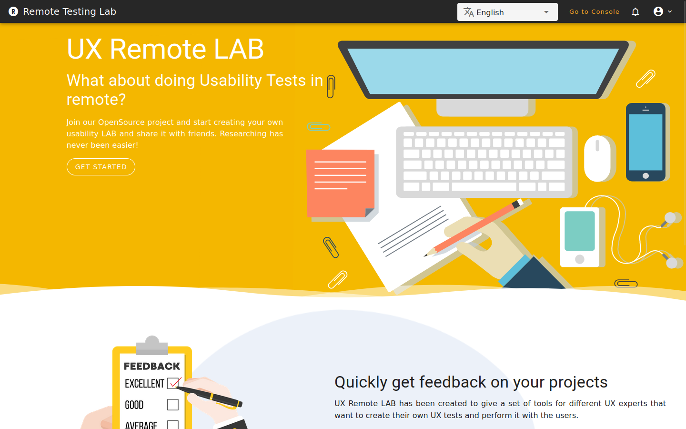
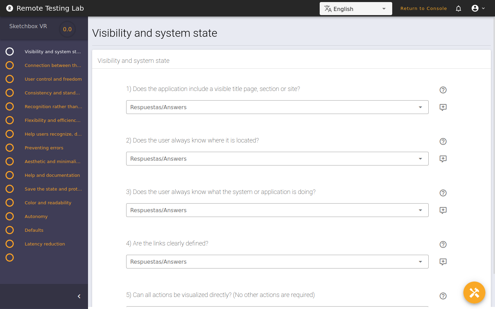
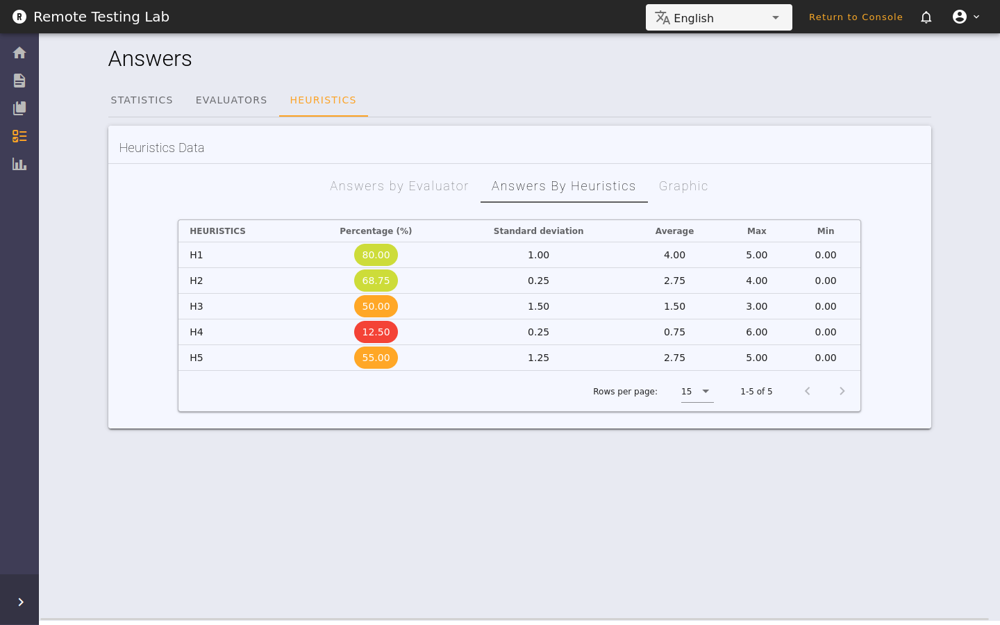
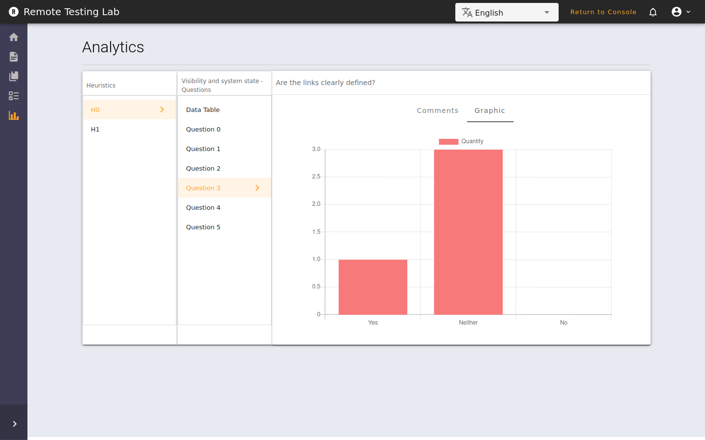
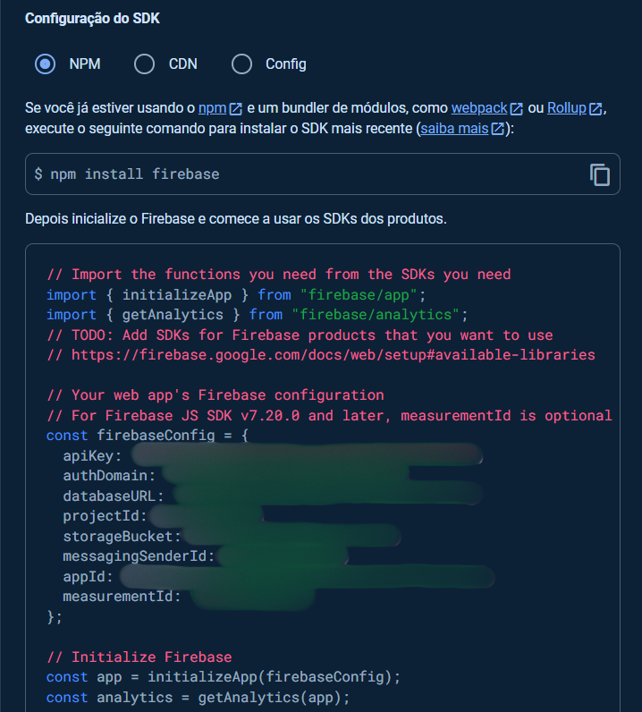

<div align="center">
  <h1>Welcome to UX Remote LAB</h1>
  <p><strong>UX Remote LAB</strong> is a user-friendly platform for usability testing and heuristic evaluation. Designed and provided by <a href="https://retlab-dev.firebaseapp.com/">UX Remote LAB</a>, it is a web application developed to assist project creators in gathering valuable insights from their users.</p>
</div>

<div align="center">
  <a href="https://retlab-dev.firebaseapp.com/"><strong>Read The Docs</strong></a>
</div>
<div align="center">
  <a href="https://retlab-dev.firebaseapp.com/">Live Demo</a>
</div>

<hr />
<div align="center">
  <table >
    <tr>
      <td></td>
      <td>User Friendly</td>
    </tr>
    <tr>
      <td></td>
      <td>Heuristics Tests</td>
    </tr>
    <tr>
      <td></td>
      <td>Answers Views</td>
    </tr>
    <tr>
      <td></td>
      <td>Analytics Graphs</td>
    </tr>
  </table>
</div>

## About

UX Remote LAB is an open-source platform designed to collect usability feedback from users. It allows you to gather user reviews, analyze them, and create comprehensive reports to better understand your application's usability. Additionally, it offers heuristic tests, enabling experts to evaluate your application's compliance with usability principles.

### Community & Experience

UX Remote LAB provides a collaborative environment for creators to share their projects and receive voluntary assistance with usability reviews. You can communicate with evaluators and send them invitations for testing your applications.

### Support

- [Report a Bug 🐛](https://github.com/uramakilab/remote-usability-lab/issues/new)
- [Request a Feature 🚀](https://github.com/uramakilab/remote-usability-lab/issues/new)
- [Ask a Question 🤗](https://github.com/uramakilab/remote-usability-lab/discussions)

For commercial support, academic collaborations, and answers to common questions, please use [Get Support]() to contact us.
### Development Environment

- Node.js version: ≤ 16.20.1
- Vue.js version: 2.6.12
- Vue CLI version: 4.3.1
- Vuetify version: 2.3.10

## Video Guide

<a href='https://youtu.be/dAf4LRxITCc'>Tutorial - Running RUXAILAB with Firebase Emulators   🖥️</a>

## Getting Started

Follow these steps to set up the development environment and run the application locally:

   ```bash
   # Install dependencies
   npm install
   pip install
   ```
 Open Firebase / Firestore and start a project.

   - In the project dashboard, click on the settings button on the left side of the screen (gear icon).
  - In the project settings, under the general tab, scroll down to the end of the screen, you should find the following screen. 
<div align="center">
  
</div> 

In the folder of your project, create a file with the name .env and put the following data:

  ```javascript
  VUE_APP_FIREBASE_API_KEY=""
  VUE_APP_FIREBASE_AUTH_DOMAIN=""
  VUE_APP_FIREBASE_DB_URL=""
  VUE_APP_FIREBASE_PROJECT_ID=""
  VUE_APP_FIREBASE_STORAGE_BUCKET=""
  VUE_APP_FIREBASE_MESSAGING_SENDER_ID=""
  VUE_APP_FIREBASE_APP_ID=""


  // Doesn't need changes
  VUE_APP_I18N_LOCALE="en"
  VUE_APP_I18N_FALLBACK_LOCALE="en"
  ```
Then, complete the information in your .env file with the firebase information, respectively in their fields, and run:


  ```bash
   # Run the application locally
   npm run serve
   ```
## Running with Firebase Emulators 
- Add ```firebase.json``` file with the following code snippet:

```javascript
    {
  "firestore": {
    "rules": "firestore.rules",
    "indexes": "firestore.indexes.json"
  },
  "functions": [
    {
      "predeploy": ["npm --prefix \"$RESOURCE_DIR\" run lint"],
      "source": "functions",
      "codebase": "functions"
    },
    {
      "source": "weight_function",
      "codebase": "weight_function",
      "ignore": ["venv", ".git", "firebase-debug.log", "firebase-debug.*.log"]
    }
  ],
  "hosting": {
    "site": "ruxailab-dev",
    "public": "dist",
    "ignore": ["firebase.json", "**/.*", "**/node_modules/**"],
    "rewrites": [
      {
        "source": "**",
        "destination": "/index.html"
      }
    ]
  },
  "emulators": {
    "auth": {
      "port": 9099
    },
    "functions": {
      "port": 5001
    },
    "firestore": {
      "port": 8081
    },
    "hosting": {
      "port": 5000
    },
    "ui": {
      "enabled": true
    },
    "singleProjectMode": true,
    "storage": {
      "port": 9199
    }
  },
  "storage": {
    "rules": "storage.rules"
  }
}
	
```
Setup your Firebase Emulators

Run:

```bash

firebase use (choose your option)
firebase emulators:start

```

## Running Python Function 

To calculate heuristic weights, run:

 ```bash	
 # Run locally
  firebase init functions
  firebase use (choose your option)
  firebase emulators:start --only functions
   ```
Then get the url, go to the .env file and add the following sentence:

  ```javascript
    // Your previous code
   VUE_APP_FIREBASE_PYTHON_FUNCTION="url"
   ```

If you want to deply the fuction, change your account from spark to blaze, run:

 ```bash	
    firebase deploy --only functions
   ```
Go to firebase panel -> functions -> on the right side of the function press "detailed usage statistics".
There you can get the url and replace on .env file.

## License

MIT © [UX Remote LAB](https://github.com/uramakilab/remote-usability-lab)
