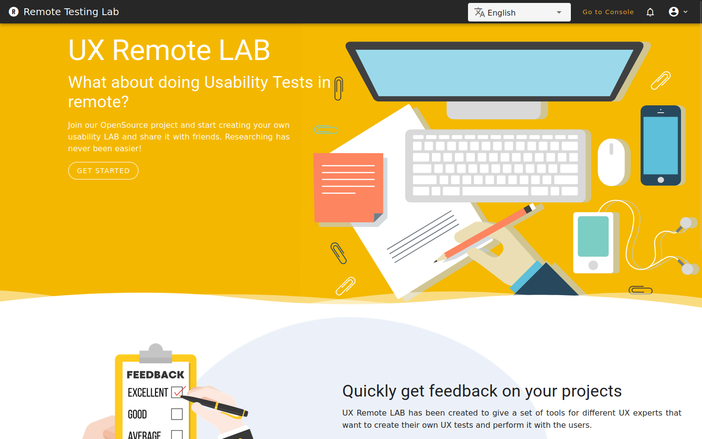
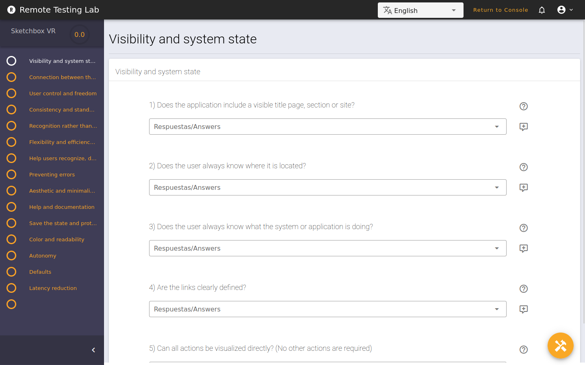
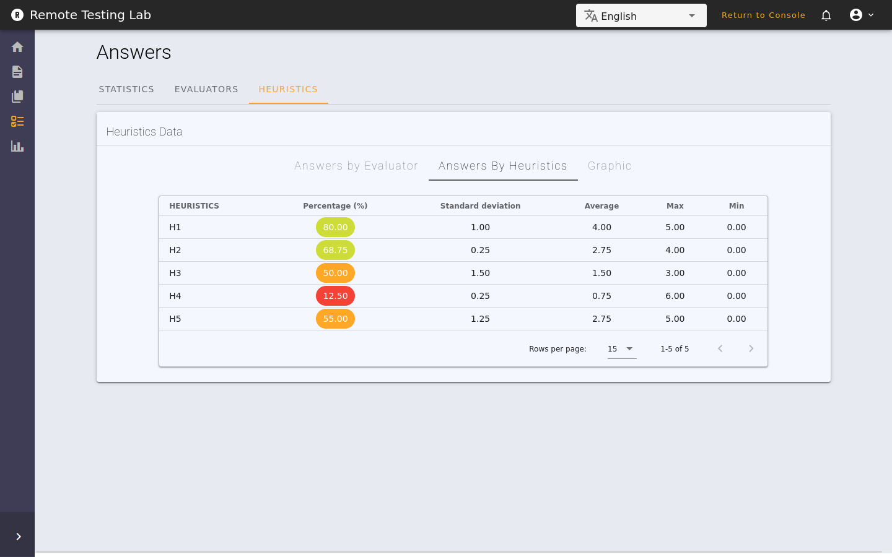
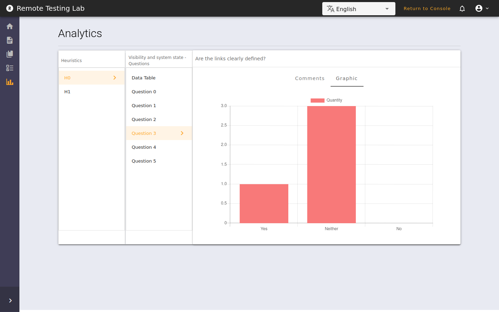

<div align="center">
  <h1>Welcome to UX Remote LAB</h1>
  <p>
    <a href="https://codecov.io/gh/ruxailab/RUXAILAB">
      
    </a>
  </p>
  <p><strong>UX Remote LAB</strong> is a user-friendly platform for usability testing and heuristic evaluation. Designed and provided by UX Remote LAB, it is a web application developed to assist project creators in gathering valuable insights from their users.</p>
</div>

<hr />
<div align="center">
  <table >
    <tr>
      <td></td>
      <td>User Friendly</td>
    </tr>
    <tr>
      <td></td>
      <td>Heuristics Tests</td>
    </tr>
    <tr>
      <td></td>
      <td>Answers Views</td>
    </tr>
    <tr>
      <td></td>
      <td>Analytics Graphs</td>
    </tr>
  </table>
</div>

## About

UX Remote LAB is an open-source platform designed to collect usability feedback from users. It allows you to gather user reviews, analyze them, and create comprehensive reports to better understand your application's usability. Additionally, it offers heuristic tests, enabling experts to evaluate your application's compliance with usability principles.

### Community & Experience

UX Remote LAB provides a collaborative environment for creators to share their projects and receive voluntary assistance with usability reviews. You can communicate with evaluators and send them invitations for testing your applications.

### Support

- [Contributing Guide 📝](CONTRIBUTING.md)
- [Report a Bug 🐛](https://github.com/uramakilab/remote-usability-lab/issues/new)
- [Request a Feature 🚀](https://github.com/uramakilab/remote-usability-lab/issues/new)
- [Ask a Question 🤗](https://github.com/uramakilab/remote-usability-lab/discussions)

For commercial support, academic collaborations, and answers to common questions, please use [Get Support]() to contact us.

### Development Environment

- Node.js version: ≤ 24.12.0
- Vue.js version: 3.5.26
- Vue CLI version: 5.0.8
- Vuetify version: 3.11.6
- Python version: 3.11.8
- Recommended formatter: Prettier - Code formatter

## Quick Start

### For End Users

```bash
# Clone the repository
git clone https://github.com/uramakilab/remote-usability-lab.git
cd remote-usability-lab

# Install dependencies
npm install

# Run development server
npm run serve
```

### For Contributors & Developers

**Want to contribute or set up a complete development environment?**

Please see our [**CONTRIBUTING.md**](CONTRIBUTING.md) guide for:

- 🐳 Docker setup with Firebase Emulators (recommended)
- 🔧 Production Firebase configuration
- 📋 Contribution workflow and guidelines
- ✅ Code standards and testing
- 🐛 Issue reporting

### Video Tutorial

For a visual walkthrough of running RUXAILAB with Firebase Emulators, check out:
[Tutorial - Running RUXAILAB with Firebase Emulators 🖥️](https://youtu.be/dAf4LRxITCc)

- Add `firebase.json` file with the following code snippet:

```javascript
    {
  "firestore": {
    "rules": "firestore.rules",
    "indexes": "firestore.indexes.json"
  },
  "functions": [
    {
      "predeploy": ["npm --prefix \"$RESOURCE_DIR\" run lint"],
      "source": "functions",
      "codebase": "functions"
    },
    {
      "source": "weight_function",
      "codebase": "weight_function",
      "ignore": ["venv", ".git", "firebase-debug.log", "firebase-debug.*.log"]
    }
  ],
  "hosting": {
    "site": "ruxailab-dev",
    "public": "dist",
    "ignore": ["firebase.json", "**/.*", "**/node_modules/**"],
    "rewrites": [
      {
        "source": "**",
        "destination": "/index.html"
      }
    ]
  },
  "emulators": {
    "auth": {
      "port": 9099
    },
    "functions": {
      "port": 5001
    },
    "firestore": {
      "port": 8081
    },
    "hosting": {
      "port": 5000
    },
    "ui": {
      "enabled": true
    },
    "singleProjectMode": true,
    "storage": {
      "port": 9199
    }
  },
  "storage": {
    "rules": "storage.rules"
  }
}

```

Setup your Firebase Emulators by uncommenting the lines under 'emulators if running locally' in src/index.js.

Run:

```bash

firebase use (choose your option)
firebase emulators:start

```

## Running Python Function

To calculate heuristic weights, run:

```bash
# Run locally
 firebase init functions
 firebase use weight_function
 firebase emulators:start --only functions
```

Then get the url, go to the .env file and add the following sentence:

```javascript
// Your previous code
VUE_APP_FIREBASE_PYTHON_FUNCTION = 'url'
```

If you want to deply the fuction, change your account from spark to blaze, run:

```bash
   firebase deploy --only functions
```

Go to firebase panel -> functions -> on the right side of the function press "detailed usage statistics".
There you can get the url and replace on .env file.

## Docker Setup

### Building the Docker Image

To build the Docker image for UX Remote LAB, navigate to the project's root directory and run the following command:

```bash
docker build -t uxremotelab .
```

### Running the Application using Docker

After building the image, you can run the application in a Docker container using:

Note: Ensure you have created the .env file and filled it with all required variables before running the following command:

```bash
docker run -d --env-file .env -p 5000:5000 uxremotelab
```

Visit `http://localhost:5000` in your browser to access the UX Remote LAB platform.

## License

MIT © [RUXAILAB](https://github.com/uramakilab/remote-usability-lab)
