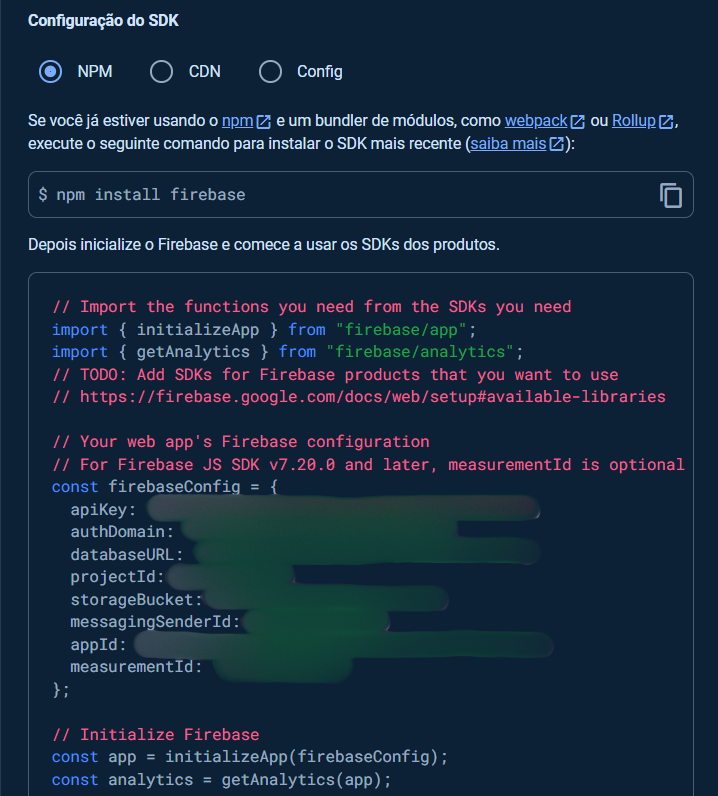

<div align="center">
  <h1>Welcome to UX Remote LAB</h1>
  <p><strong>UX Remote LAB</strong> is a user-friendly platform for usability testing and heuristic evaluation. Designed and provided by UX Remote LAB, it is a web application developed to assist project creators in gathering valuable insights from their users.</p>
</div>

<hr />
<div align="center">
  <table >
    <tr>
      <td></td>
      <td>User Friendly</td>
    </tr>
    <tr>
      <td></td>
      <td>Heuristics Tests</td>
    </tr>
    <tr>
      <td></td>
      <td>Answers Views</td>
    </tr>
    <tr>
      <td></td>
      <td>Analytics Graphs</td>
    </tr>
  </table>
</div>

## About

UX Remote LAB is an open-source platform designed to collect usability feedback from users. It allows you to gather user reviews, analyze them, and create comprehensive reports to better understand your application's usability. Additionally, it offers heuristic tests, enabling experts to evaluate your application's compliance with usability principles.

### Community & Experience

UX Remote LAB provides a collaborative environment for creators to share their projects and receive voluntary assistance with usability reviews. You can communicate with evaluators and send them invitations for testing your applications.

### Support

- [Contributing Guide 📝](https://github.com/ruxailab#contributing)
- [Report a Bug 🐛](https://github.com/uramakilab/remote-usability-lab/issues/new)
- [Request a Feature 🚀](https://github.com/uramakilab/remote-usability-lab/issues/new)
- [Ask a Question 🤗](https://github.com/uramakilab/remote-usability-lab/discussions)

For commercial support, academic collaborations, and answers to common questions, please use [Get Support](https://github.com/uramakilab/remote-usability-lab/discussions) to contact us.

### Development Environment

- Node.js version: ≤ 22.15.1
- Vue.js version: 3.5.13
- Vue CLI version: 5.0.8
- Vuetify version: 3.7.18
- Python version: 3.11.8

## Video Guide

<a href='https://youtu.be/dAf4LRxITCc'>Tutorial - Running RUXAILAB with Firebase Emulators 🖥️</a>

## Getting Started

Follow these steps to set up the development environment and run the application locally:

```bash
# Install dependencies
npm install

# Create your local env file
cp .env.example .env

# (Optional) Python dependencies (only needed for Python tools/functions)
python -m pip install -r weight_function/requirements.txt
python -m pip install -r ishikawa_tools/requirements.txt
```

Open Firebase / Firestore and start a project.

- In the project dashboard, on the left hand side menu, click on build, click on realtime database and activate it.
- In the project dashboard, click on the settings button on the left side of the screen (gear icon).
- In the project settings, under the general tab, scroll down to the end of the screen, you should find the following screen.
- If you haven't created a web app, you need to create one first before being able to see firebaseConfig.
  <div align="center">
    
  </div>

Fill in `.env` with your Firebase project credentials (minimum needed to run the app):

```ini
VUE_APP_FIREBASE_API_KEY=""
VUE_APP_FIREBASE_AUTH_DOMAIN=""
VUE_APP_FIREBASE_DB_URL=""
VUE_APP_FIREBASE_PROJECT_ID=""
VUE_APP_FIREBASE_STORAGE_BUCKET=""
VUE_APP_FIREBASE_MESSAGING_SENDER_ID=""
VUE_APP_FIREBASE_APP_ID=""

# Doesn't need changes
VUE_APP_I18N_LOCALE="en"
VUE_APP_I18N_FALLBACK_LOCALE="en"
```

See `.env.example` for optional integrations (Cloud Functions URL, transcription/sentiment APIs, Eye Lab, etc.). Some features require `VUE_APP_CLOUD_FUNCTIONS_URL`.

Then run:

```bash
 # Run the application locally
 npm run serve
```

## Running with Firebase Emulators

You can run the app using either:

1) **Firebase (Cloud)**: create a Firebase project, fill `.env`, then run `npm run serve`.
2) **Firebase Emulators (Local)**: run the Firebase emulators on your machine and point the app to them.

### Option A: Firebase (Cloud)

- Create a Firebase project and fill `.env` with your project credentials.
- Run `npm run serve`.

### Option B: Firebase Emulators (Local)

1. Ensure you have a `firebase.json` in the project root (you can use the existing one, or create/replace it with this):

```json
{
  "firestore": {
    "rules": "firestore.rules",
    "indexes": "firestore.indexes.json"
  },
  "functions": [
    {
      "predeploy": ["npm --prefix \"$RESOURCE_DIR\" run lint"],
      "source": "functions",
      "codebase": "functions"
    },
    {
      "source": "weight_function",
      "codebase": "weight_function",
      "ignore": ["venv", ".git", "firebase-debug.log", "firebase-debug.*.log"]
    }
  ],
  "hosting": {
    "site": "ruxailab-dev",
    "public": "dist",
    "ignore": ["firebase.json", "**/.*", "**/node_modules/**"],
    "rewrites": [
      {
        "source": "**",
        "destination": "/index.html"
      }
    ]
  },
  "emulators": {
    "auth": { "port": 9099 },
    "functions": { "port": 5001 },
    "firestore": { "port": 8081 },
    "hosting": { "port": 5000 },
    "ui": { "enabled": true },
    "singleProjectMode": true,
    "storage": { "port": 9199 }
  },
  "storage": {
    "rules": "storage.rules"
  }
}
```

2. Point the frontend to the emulators by uncommenting the lines under `// Emulators if running locally` in `src/app/plugins/firebase/index.js`.

3. Start the emulators:

```bash
firebase use <alias>
firebase emulators:start
```

4. In another terminal, run `npm run serve`.

## Running Python Function

To calculate heuristic weights, run:

```bash
firebase use <alias>
firebase emulators:start --only functions
```

Configure `VUE_APP_CLOUD_FUNCTIONS_URL` in `.env` (see `.env.example`) if you want the frontend to call deployed/emulated functions.

If you want to deploy the function, change your account from spark to blaze, run:

```bash
   firebase deploy --only functions
```

Go to firebase panel -> functions -> on the right side of the function press "detailed usage statistics".
There you can get the url and replace it in `.env`.

## Docker Setup

### Building the Docker Image

To build the Docker image for UX Remote LAB, navigate to the project's root directory and run the following command:

```bash
docker build -t uxremotelab .
```

### Running the Application using Docker

After building the image, you can run the application in a Docker container using:

Note: Ensure you have created the .env file and filled it with all required variables before running the following command:

```bash
docker run -d --env-file .env -p 5000:5000 uxremotelab
```

Visit `http://localhost:5000` in your browser to access the UX Remote LAB platform.

## License

MIT © [UX Remote LAB](https://github.com/uramakilab/remote-usability-lab)
